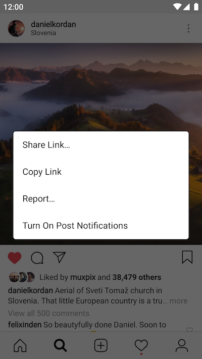
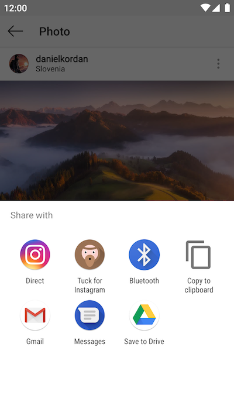
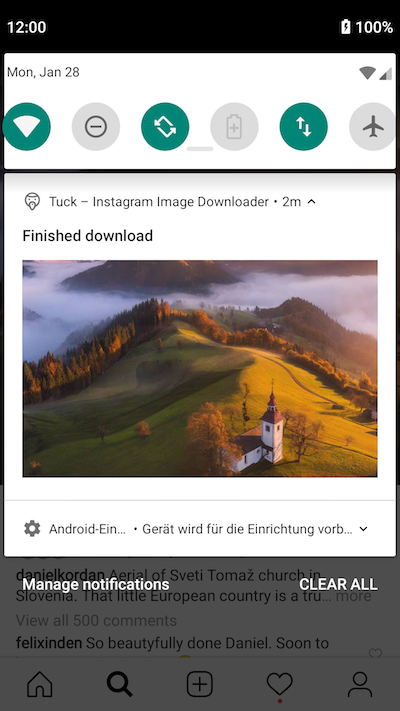

# Tuck – Instagram Image Downloader

  

**A reliable and lightweight Downloader for Instagram images. Written in Kotlin. For Android.**

> * **tuck** _(verb)_ – Put or keep (something) in a specified place so as to be hidden, secure, comfortable, or tidy.  
> * Friar **Tuck** is a companion to Robin Hood in the legends about that character.

### Features

* Lean: No UI, no App icon – works in the background
* Mighty: Downloads all images & videos, even of posts with multiple photos & videos
* Thorough: Downloads all photos in the best available resolution
* Free: No ads, no user tracking, completely Open Source

### How-to

1. In the Instagram app, just share the photo you like to download and select `Share via…` or `Share Link…` (Depending on Instagram version).
2. Select `Tuck – Instagram Image Downloader` and watch the magic happen.

### Info
* All images will be downloaded to the `/Pictures/Tuck/` folder. Videos to `/Movies/Tuck/`.
* The filename will be in the format `<username>.<yyyyMMdd>.<shortcode>.[jpg/mp4]`.  
  e. g. `danielkordan.20181119.BqXaCwGA_Hx.jpg`
* `shortcode` is the id of the image. With it you can find the post again:  
   e. g. for the shortcode `BqXaCwGA_Hx` open this link to get to the post, again: <https://www.instagram.com/p/BqXaCwGA_Hx/>

### Screenshots

   
   
   

## License

Copyright (C) 2019 Maximilian Salomon
