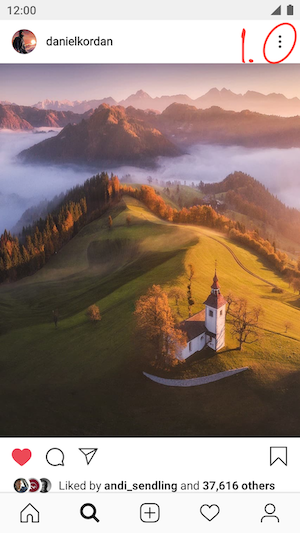
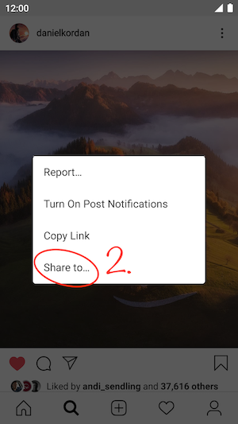
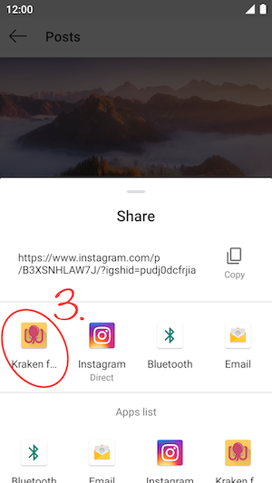
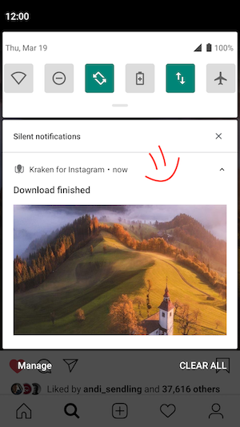

# Kraken – Instagram Image & Video Downloader

<!-- logo -->

  
  
A reliable, native and lightweight Downloader for Instagram images & videos. Written in Kotlin. For Android.

  

### Features

* Lean: No UI, no App icon – works in the background
* Mighty: Downloads all images & videos, even of posts with multiple photos & videos
* Thorough: Downloads all photos in the best available resolution
* Free: No ads, no user tracking, completely Open Source
* Up-to-date: Fully supports Android 12

### How-to

1. In the Instagram app, just share the photo you like to download
2. Select `Share to…`.
3. Pick `Kraken for Instagram` and watch the magic happen.

### Screenshots

   
   
   
   

### Info
* All images will be downloaded to the `/Pictures/Kraken/` folder. Videos to `/Movies/Kraken/`.
* The filename will be in the format `<username>.<yyyyMMdd>.<shortcode>.[jpg/mp4]`.  
  e. g. `danielkordan.20181119.BqXaCwGA_Hx.jpg`
* `shortcode` is the id of the image. With it you can find the post again:  
   e. g. for the shortcode `BqXaCwGA_Hx` open this link to get to the post, again: <https://www.instagram.com/p/BqXaCwGA_Hx/>
* Works only on public posts. Private profiles are not supported by Kraken, even if you are following the private profile.

## License

Copyright (C) Maximilian Salomon
